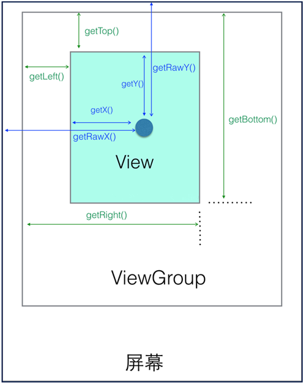

# 1.View简介
View是Android所有控件的基类，同时ViewGroup也是继承自View，看下面这张图我们就会有一个直观的了解：

# 2.Android坐标系
要了解视图坐标系我们只需要看懂一张图就可以了：

### View获取自身宽高 
* getHeight()：获取View自身高度
* getWidth()：获取View自身宽度

### View自身坐标
通过如下方法可以获得View到其父控件（ViewGroup）的距离：
* getTop()：获取View自身顶边到其父布局顶边的距离
* getLeft()：获取View自身左边到其父布局左边的距离
* getRight()：获取View自身右边到其父布局左边的距离
* getBottom()：获取View自身底边到其父布局顶边的距离 

###  MotionEvent提供的方法
  我们看上图那个深蓝色的点，假设就是我们触摸的点，我们知道无论是View还是ViewGroup，最终的点击事件都会由onTouchEvent(MotionEvent
  event)方法来处理，MotionEvent也提供了各种获取焦点坐标的方法：
* getX()：获取点击事件距离控件左边的距离，即视图坐标
* getY()：获取点击事件距离控件顶边的距离，即视图坐标
* getRawX()：获取点击事件距离整个屏幕左边距离，即绝对坐标
* getRawY()：获取点击事件距离整个屏幕顶边的的距离，即绝对坐标